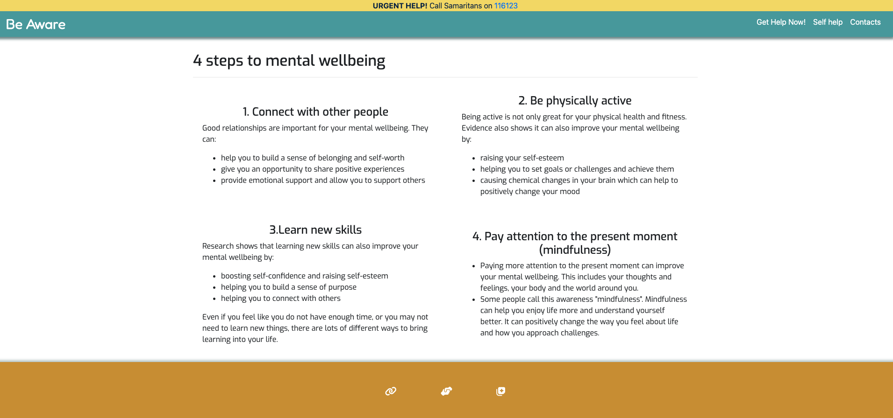

# Be Aware

## Overview

### Purpose
This project aims to raise awareness about mental health and connect people struggling with it to the right resources and support. We also want to provide advice to those concerned about a loved one's mental health.

### Target Audience
- Individuals struggling with mental health issues who may be unaware of available resources or hesitant to seek help.
- People who care about someone with mental health challenges and want to learn how to support them effectively.
- Members of the general public who may benefit from increased awareness and understanding of mental health.

## User Stories

- **User Story 1:** "As a user struggling with mental health, I want to easily find relevant resources and support services in my area."

  **Acceptance Criteria:** 
  - The user can search for resources by location, type of service (e.g., help, support groups, self help, emergency contacts), or specific mental health condition.
  - The search results provide accurate and up-to-date information about the resource, including contact details, website, and hours of operation.
 

- **User Story 2:** "As a user with a mental health condition, I want to connect with others who understand my experiences and can offer support."
 
  **Acceptance Criteria:**

   - Users can join online communities or support groups based on specific mental health conditions or interests.
  - There are features to facilitate private messaging or group discussions.

- **User Story 3:** “As a user concerned about a loved one's mental health, I want to access advice from qualified mental health professionals.”
  **Acceptance Criteria:**
  - The platform offers a Q&A forum or chat feature where users can ask questions to mental health professionals.
  - The responses from professionals are provided in a timely and informative manner.
  - The platform ensures the privacy and confidentiality of all user information.
   - The platform takes user to the correct information/help location.

### Should-Have User Stories
   **Core Features:** 
  - Clear and Concise Navigation: A user-friendly navigation menu helps visitors easily find the information they need.
  - Responsive Design: The website should adapt to different screen sizes (desktop, tablet, mobile) for optimal viewing.
  - Contact Information: Make easier for visitors to get in touch via contact forms, phone numbers, or email addresses for helplines
 
  **Content Features:** 
  - High-Quality Content: Create valuable and informative content that is relevant to the target audience.
  - Regular Updates: Keep your content fresh and up-to-date to maintain user interest.
  - Visual Appeal: Use high-quality images, videos, and graphics to enhance the visual appeal of your website.

  **Could-Have Features:** 
  - Search Functionality: A search bar allows users to quickly find specific content.
  - Social Media Integration: Connect your website to your social media profiles to increase visibility and engagement.

## Design Decisions

### Wireframes
  
  - Wireframe and layout planned of a viewport on small screen and big screen 

### Color palettes

  

### Fonts

   #### Logo : Fredoka.   
   #### Primary font : Exo                  
   #### Secondary font : Sans-serif
  
  

### Accessibility Considerations

 #### Color Contrast:

- I use a color palette that provides adequate contrast between text and background elements, ensuring readability for users with visual impairments.

#### Alt Text for Images:

- I provide descriptive alt text for all images, accurately conveying their content to users with visual impairments and those using screen readers.

#### Additional Considerations:

- I use appropriate heading levels (h1, h2, h3, etc.) to structure the content, making it easier for users with screen readers to navigate.
- I ensure that all elements can be navigated and activated using a keyboard, without relying solely on a mouse.
- I provide clear focus indicators to help users understand which element is currently active.
- I use a responsive design to ensure that my applications are accessible on various devices, including mobile and tablets.
- I implement ARIA attributes to provide additional semantic information to assistive technologies.
- I used alt attributes to all buttons for a better user experience for visually impaired users.

Please not that some elements might not be used*

## AI Tools Usage

 - I used Gemini, a large language model, to assist me in writing this README. Gemini helped me generate ideas, improve the clarity and structure of the content, and ensure that the README is informative and engaging 

## Testing and Validation 
### websites 
- https://validator.w3.org/
- https://jigsaw.w3.org/css-validator/

### CSS code Validation

 ### Html Code Validation

#### Validation Index page
  
 

#### Validation Self help page
 

  #### Validation Form page
   

## Testing Results

 ### Small Screen
 #### Small Screen Index Page
 
  #### Small Screen Self Help Page
 
  #### Small Screen Form Page
 

 ### Medium Screen
 #### Medium Screen Index Page
 
  #### Medium Screen Self Help Page
 
  #### Medium Screen Form Page
 

 ### Large Screen
 #### Large Screen Index page
 
  #### Large Screen Self Help Page
 
  #### Large Screen Form Page
 

 ### Navbar Dropdown
 

 ### Footer

 ### Problems Found

 #### Sideways Small Screen Problem
 

During testing I found that in small screens when changed the orientation of the screen from portrait to landscape the form gets engulfed by the navbar and footer.

Please not that this problem still not fixed*

### Tools used for finding problems.

 #### Chrome DevTools

 During the project's structural development phase, I encountered various obstacles. Through the use of Chrome DevTools, I was able to effectively diagnose and rectify these problems.

## Deployment

#### Deployment Link
https://fabiowxavier.github.io/be-aware/

### Deployment Process
The deployment process went smoothly overall, however, I did identify a small problem with the contacts.html form when viewed on mobile devices.

### Final Thoughts
At first, I was worried about this project, but as I worked on it, I got more comfortable. There were a few things that were tricky and took longer than I expected. Even though I learned a lot about HTML, CSS, and Bootstrap in the past four weeks, it took some time to really understand it all. But once I started building the website, I remembered more and was able to put it together.

## Code Attribution

**Bootstrap:**

This project uses Bootstrap, a popular front-end framework. 

**MDBootstrap:**

This project utilizes MDBootstrap, a Material Design framework for Bootstrap. 

**W3Schools:**

This project benefited from tutorials and examples found on W3Schools.

## Future Improvements

As the future improvements in this project, I aim to improve the form's responsiveness on mobile devices and potentially expand the website's content offerings. Additionally, incorporating a search engine would provide visitors with a more efficient way to find information.

### Resources

- https://www.highfivedesign.co/
- https://www.portlandseogrowth.com/keywords-for/mental-health/
- https://gemini.google.com/app
- https://www.betterup.com/blog/mental-health-awareness#:~:text=Mental%20health%20awareness%20is%20the,and%20their%20conditions%20go%20untreated.
- https://www.rethink.org/aboutus/what-we-do/advice-and-information-service/get-help-now/
- https://www.nhs.uk/mental-health/self-help/guides-tools-and-activities/five-steps-to-mental-wellbeing/
- https://getbootstrap.com/docs/4.6/getting-started/introduction/
- https://github.com/dashboard
- https://fonts.google.com/
- https://mdbootstrap.com/
- https://www.w3schools.com/